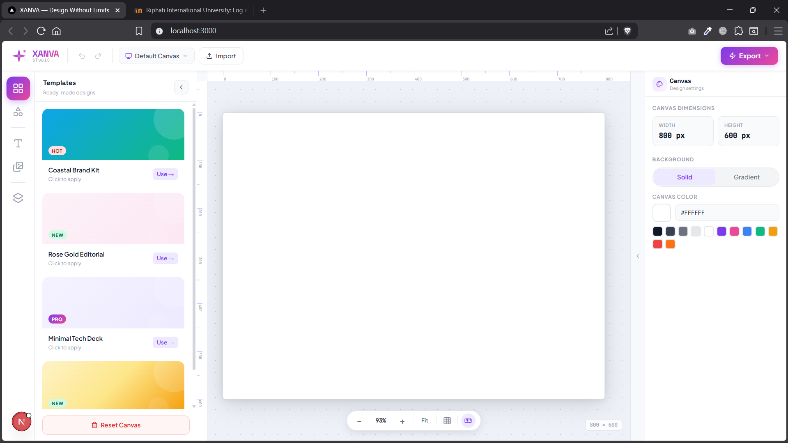
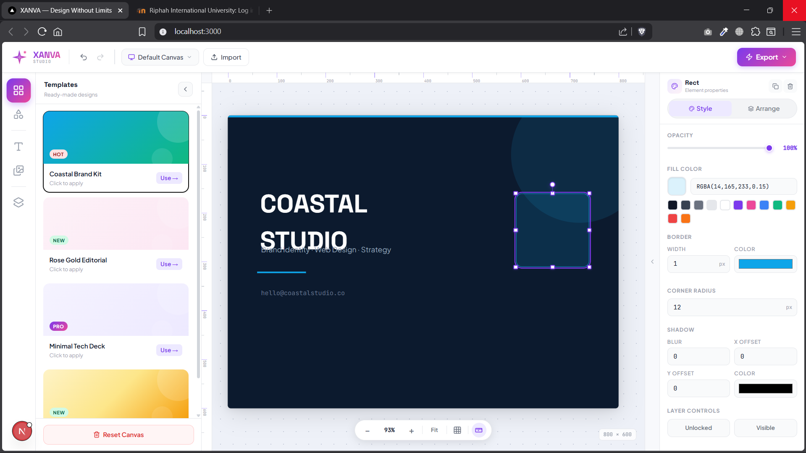
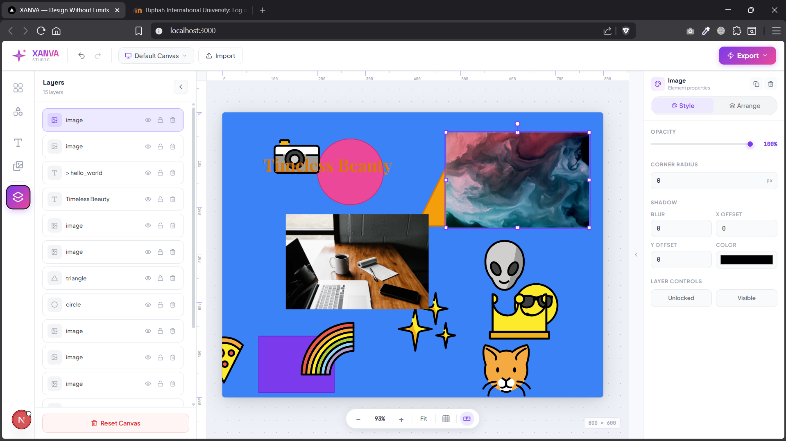
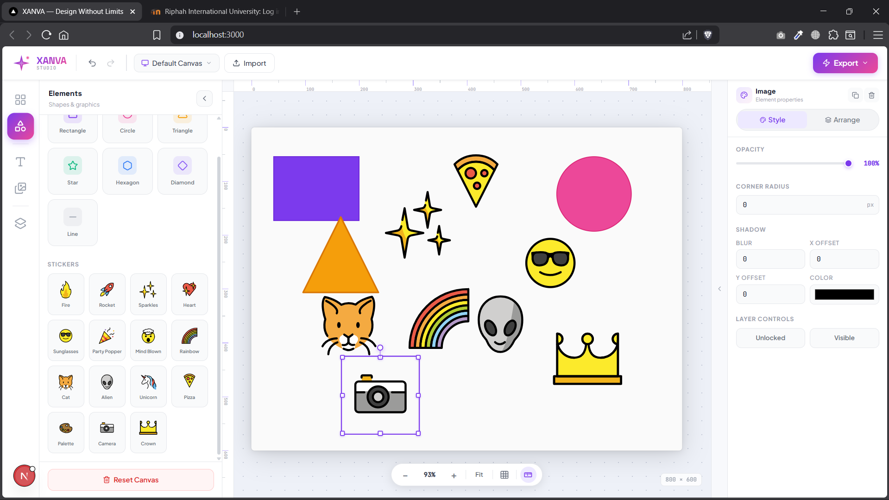

This is a [Next.js](https://nextjs.org) project bootstrapped with [`create-next-app`](https://nextjs.org/docs/app/api-reference/cli/create-next-app).

## Getting Started

First, run the development server:

```bash
npm run dev
# or
yarn dev
# or
pnpm dev
# or
bun dev
```

Open [http://localhost:3000](http://localhost:3000) with your browser to see the result.

You can start editing the page by modifying `app/page.tsx`. The page auto-updates as you edit the file.

This project uses [`next/font`](https://nextjs.org/docs/app/building-your-application/optimizing/fonts) to automatically optimize and load [Geist](https://vercel.com/font), a new font family for Vercel.

## Learn More

To learn more about Next.js, take a look at the following resources:

- [Next.js Documentation](https://nextjs.org/docs) - learn about Next.js features and API.
- [Learn Next.js](https://nextjs.org/learn) - an interactive Next.js tutorial.

You can check out [the Next.js GitHub repository](https://github.com/vercel/next.js) - your feedback and contributions are welcome!

## Deploy on Vercel

The easiest way to deploy your Next.js app is to use the [Vercel Platform](https://vercel.com/new?utm_medium=default-template&filter=next.js&utm_source=create-next-app&utm_campaign=create-next-app-readme) from the creators of Next.js.

# XANVA - Design Without Limits

A modern, feature-rich Canva clone built with **Next.js**, **React**, and **TypeScript**. Create, edit, and design beautiful graphics with an intuitive drag-and-drop interface.

## 🎨 Features

- **Drag & Drop Canvas** - Easily drag elements across the canvas
- **Resizable Elements** - Adjust width and height of any element
- **Rotation** - Rotate elements with smooth controls
- **Text Editing** - Add and edit text with custom styling (font, size, color)
- **Shape Support** - Add rectangles, circles, and other shapes
- **Image Support** - Upload and place images on your canvas
- **Z-Index Management** - Layer elements and control depth
- **Multiple Selection** - Select and modify multiple elements at once
- **Undo/Redo** - Full history support for your edits
- **Export Canvas** - Download your designs as images
- **Color Picker** - Choose from a wide palette of colors
- **Shadow Effects** - Add drop shadows to elements
- **Opacity Control** - Adjust transparency of elements
- **Snap Lines** - Alignment guides for precise positioning
- **Responsive Design** - Works seamlessly on different screen sizes

## 📸 Screenshots

### Main Canvas Interface


### Design Tools & Sidebar


### Advanced Editing


### Export & Styling Options


## 🛠️ Tech Stack

- **Frontend Framework**: [Next.js](https://nextjs.org) 16.2
- **UI Library**: [React](https://react.dev) 19.2
- **Language**: [TypeScript](https://www.typescriptlang.org)
- **State Management**: [Zustand](https://zustand-demo.pmnd.rs)
- **Styling**: [Tailwind CSS](https://tailwindcss.com)
- **Drag & Drop**: [react-draggable](https://github.com/react-grid-layout/react-draggable)
- **Resize Handling**: [react-resizable](https://github.com/react-grid-layout/react-resizable)
- **Canvas Export**: [html2canvas](https://html2canvas.hertzen.com)
- **Icons**: [Lucide React](https://lucide.dev)
- **Utilities**: [UUID](https://github.com/uuidjs/uuid)

## 🚀 Getting Started

### Prerequisites

Make sure you have the following installed:
- Node.js (v18 or higher)
- npm or yarn

### Installation

1. **Clone the repository**
   ```bash
   git clone <repository-url>
   cd canva-clone
   ```

2. **Install dependencies**
   ```bash
   npm install
   ```

3. **Run the development server**
   ```bash
   npm run dev
   ```

4. **Open in browser**
   Navigate to [http://localhost:3000](http://localhost:3000) to see the application

## 📝 Available Scripts

- `npm run dev` - Start the development server
- `npm run build` - Build the application for production
- `npm start` - Start the production server
- `npm run lint` - Run ESLint to check code quality

## 📁 Project Structure

```
canva-clone/
├── app/                      # Next.js app directory
│   ├── layout.tsx           # Root layout component
│   ├── page.tsx             # Main page
│   └── globals.css          # Global styles
├── components/              # React components
│   ├── Canvas.tsx           # Main canvas component with all editing logic
│   ├── Toolbar.tsx          # Top toolbar with tools and options
│   ├── LeftSidebar.tsx      # Left sidebar for element selection
│   └── RightSidebar.tsx     # Right sidebar for properties panel
├── store/                   # State management
│   └── useCanvasStore.ts    # Zustand store for canvas state
├── public/                  # Static assets
│   ├── screenshot1.png      # UI screenshots
│   ├── screenshot2.png
│   ├── screenshot3.png
│   └── screenshot4.png
├── package.json             # Project dependencies
├── tsconfig.json            # TypeScript configuration
├── next.config.ts           # Next.js configuration
├── postcss.config.mjs       # PostCSS configuration
├── tailwind.config.ts       # Tailwind CSS configuration
└── eslint.config.mjs        # ESLint configuration
```

## 💡 Usage Guide

### Creating Elements

1. **Add Text**: Click the text tool in the toolbar to add text to your canvas
2. **Add Shapes**: Use shape tools to create rectangles or circles
3. **Add Images**: Upload images from your device
4. **Drag to Canvas**: Click and drag to position elements on the canvas

### Editing Elements

1. **Select Element**: Click on any element to select it
2. **Move**: Drag the selected element to a new position
3. **Resize**: Use the handles at the corners to resize
4. **Rotate**: Use the rotation control to rotate the element
5. **Edit Properties**: Modify properties in the right sidebar (color, opacity, shadows)

### Text Editing

- Double-click on text elements to enter edit mode
- Change font size, color, and other text properties
- Press Enter to exit edit mode

### Exporting Design

- Click the "Export" button to download your design as an image
- Your design will be saved as a PNG file

## 🎯 Key Components

### Canvas Component (`components/Canvas.tsx`)
The main component handling all canvas operations including:
- Element rendering (text, shapes, images)
- Drag and drop functionality
- Resize and rotate operations
- Selected element highlighting
- Snap lines for alignment

### Store (`store/useCanvasStore.ts`)
Centralized state management using Zustand for:
- Canvas elements storage
- Selection state
- History (undo/redo)
- Element property modifications

### Toolbar (`components/Toolbar.tsx`)
Top toolbar providing:
- Element creation tools
- Canvas controls (undo, redo, clear)
- Export functionality

### Sidebars
- **Left Sidebar**: Element library and selection
- **Right Sidebar**: Properties panel for editing selected elements

## 🔧 Configuration

### Environment Variables
Currently, no environment variables are required. The application runs out of the box.

### Customize Styling
Edit `app/globals.css` to modify the global appearance or update Tailwind configuration in `tailwind.config.ts`.

## 🐛 Troubleshooting

- **Port 3000 already in use**: Run with a different port using `npm run dev -- -p 3001`
- **Elements not staying in place**: Check the zIndex value in properties panel
- **Export not working**: Ensure html2canvas library is properly installed
- **Build errors**: Clear `.next` folder and reinstall dependencies

## 📚 Learning Resources

- [Next.js Documentation](https://nextjs.org/docs)
- [React Documentation](https://react.dev)
- [TypeScript Handbook](https://www.typescriptlang.org/docs)
- [Zustand Documentation](https://zustand-demo.pmnd.rs)
- [Tailwind CSS Docs](https://tailwindcss.com/docs)

## 🤝 Contributing

Contributions are welcome! Please follow these steps:

1. Fork the repository
2. Create a feature branch (`git checkout -b feature/AmazingFeature`)
3. Commit your changes (`git commit -m 'Add some AmazingFeature'`)
4. Push to the branch (`git push origin feature/AmazingFeature`)
5. Open a Pull Request

## 📄 License

This project is licensed under the MIT License - see the LICENSE file for details.

## 👨‍💻 Author

Created as an AI assignment project at Riphah International University.

## 🎉 Acknowledgments

- Built with modern React and Next.js best practices
- Inspired by Canva's intuitive design interface
- Thanks to all the open-source libraries used in this project

---

**Happy Designing! 🚀**
